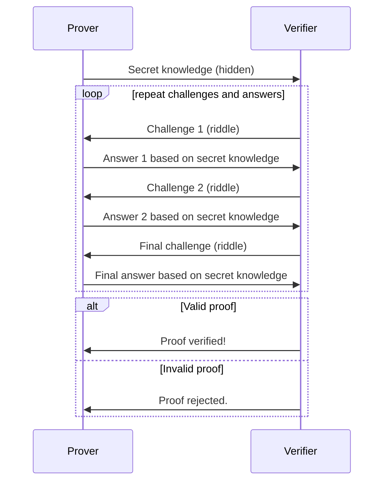

# How Zero-Knowledge works?

Understanding zero-knowledge proofs (ZKPs) may pose a challenge initially, but employing a visual aid can facilitate comprehension. So let's understand with the help of an example:

### Picture yourself in a library facing a locked room:

- Confidential knowledge: You hold a unique password to unlock the room, symbolizing your secret information within ZKP.
- Challenge-response: The librarian (verifier) tasks you with proving your possession of the password without divulging it. They present several puzzles (challenges) regarding the room's contents.
- Proof generation: Ingeniously, you solve the puzzles, providing clues derived from the password (proof) without exposing the password itself. This may entail manipulating items in the room (witnesses) according to your knowledge.
- Verification: The librarian scrutinizes your solutions and inspects the room. If your answers align logically with possessing the password (valid proof), they are convinced without ever glimpsing the password.

### Crucial elements in this visualization:

- You: Representing the prover holding secret knowledge.
- Librarian: Signifying the verifier requiring persuasion.
- Locked room: Signifying the concealed information the prover seeks to evidence without unveiling.
- Puzzles/Challenges: Interrogations posed by the verifier to evaluate the prover's knowledge.
- Responses/Proof: Astute replies rooted in the secret knowledge, withholding the secret itself.
- Room items/Witnesses: Components within the secret that the prover can manipulate to furnish proof.

While the specific methodologies of ZKPs vary across schemes, the fundamental principle remains consistent.
The illustrative depiction simplifies the understanding process, yet real-world ZKPs entail intricate mathematical operations.

This analogy serves as one approach; alternate metaphors can also aid in grasping ZKPs.
I trust this visual representation aids in comprehending the fundamental workings of ZKPs!